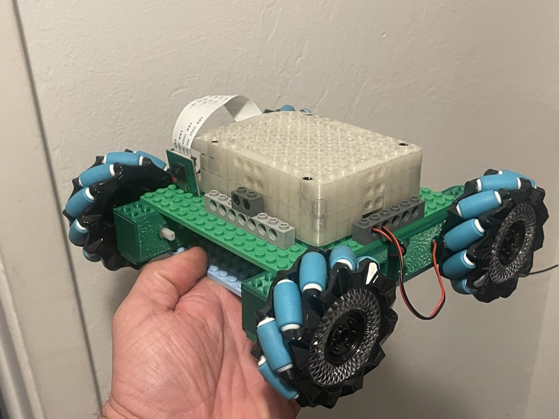
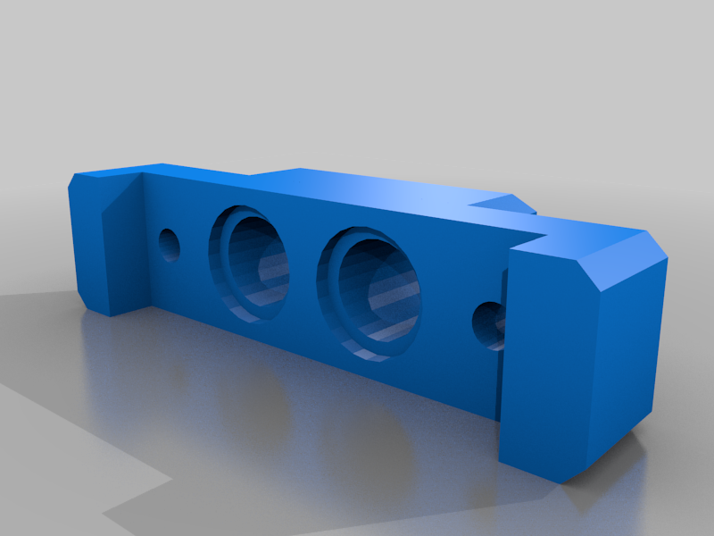
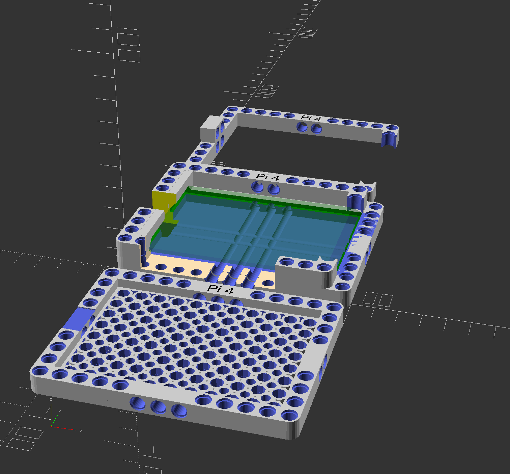
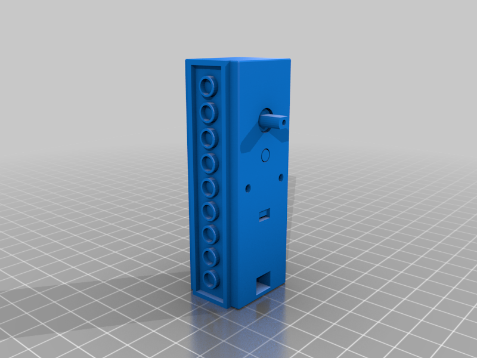

# mecanum-robot
Control system for simple mecanum-wheeled holonomic drive Raspberry Pi based robot.



## Parts List
- Raspberry Pi 4B
- Mini SD Card
- 2 x Left & Right Mecanum Wheel Pair - 48mm Diameter (TT Motor or Cross Axle (2-pack)) [Adafruit ID:4990]
- 1 x Adafruit DC & Stepper Motor Bonnet for Raspberry Pi [Adafruit ID:4280]
- 4 x DC Gearbox Motor - "TT Motor" - 200RPM - 3 to 6VDC [Adafruit ID:3777]
- 4xAA battery power pack and 4xAA batteries to power the DC & Stepper Motor Bonnet
- USB cell phone charger to provide mobile power to the RaspPi
- Micro speaker for audio out
- Raspberry Pi Camera
- Assorted legos for chassis

## 3D Printed Parts

STL files are in the [`stl/`](stl/) directory. These are sourced from Thingiverse — credit and thanks to the original creators:

| Part | Creator | License | Thingiverse Link |
|------|---------|---------|-----------------|
| Raspberry Pi Camera to Lego Technic Adaptor | ralphius | CC BY | [Thing:4409881](https://www.thingiverse.com/thing:4409881) |
| Raspberry Pi 4 LEGO Technic Enclosure | paulirotta | CC BY-NC-SA | [Thing:3713324](https://www.thingiverse.com/thing:3713324) |
| Lego Wrapper for TT Motor | Nick507 | CC BY-SA | [Thing:5272973](https://www.thingiverse.com/thing:5272973) |

<p>
<a href="stl/files/pi_cam_technic_adaptor_v2.stl"></a>
<a href="stl/files/PELA-raspberry-pi4-technic-mount-base-PLA.stl"></a>
<a href="stl/files/TTMotorLegoTop.stl"></a>
</p>

*Click any image to view the 3D model on GitHub.*

## Setup
Build the robot. Ensure that the Mecanum wheels are assigned to the four corners of the chassis such that the subwheels form an "x".

Also ensure that the motors are wired 1-4 onto the motor control bonnet clockwise in order as the robot is viewed from above. Motor 1 and 4 will then be on the front right and front left.

Clone this repo:

``` bash
git clone git@github.com:jknoll/mecanum-robot.git
```

Create a virtualenv and activate it:

```bash
$ python -m venv .mecanum-robot
$ source .mecanum-robot/bin/activate
```

Install dependencies:
```bash
$ pip install -r requirements.txt
```

Ensure that I2C is enabled:
```bash
sudo raspi-config # turn on I2C
```

## Usage
To test basic control of a single motor:
```bash
python3 motor_test.py
```

To run a mecanum wheel test pattern:
```bash
python3 robot_keyboardless.py
```
To kill motors mid-action (be ready with this command on early runs):
```bash
python3 kill.py3
```

To view webcam (not currently working):
```bash
python3 stream.py3 & # then go to [robot IP address:8000] to view the webcam
```

To drive via XBox bluetooth controller (after following the Bluetooth setup instructions below):
```bash
python3 xbox-controller-test.py
```

## Raspberry Pi Development Connection

For Pi Zeros, you can connect locally via Ethernet-over-USB-C. For non-zero Pis, directly connecting via Ethernet cable and then sshing in at `[username]@raspberrypi.local` is the easiest approach I've found. It's possible to then connect via SSH in e.g. Cursor, VS Code, etc. for development.

## Bluetooth Controller Pairing
See detailed description in ['docs/xbox_controller_setup.md'](xbox_controller_setup.md)
```bash
sudo bluetoothctl
```

In the `bluetoothctl` prompt:
```bash
power on
agent on
default-agent
scan on
```

## Startup systemd support
Call the bootstrap.sh script via systemd to enter the control loop. Example config:
```bash
[Unit]
Description=Run mecanum-robot bootstrap script at boot
After=bluetooth.target
Requires=bluetooth.target

[Service]
Type=simple
WorkingDirectory=/home/justinknoll/Documents/git/mecanum-robot
ExecStartPre=/bin/bash -c 'until [ -e /dev/input/event4 ]; do sleep 1; done'
ExecStart=/home/justinknoll/Documents/git/mecanum-robot/bootstrap.sh
Restart=on-failure

[Install]
WantedBy=multi-user.target

``` 

To stop the systemd managed process in order to do manual dev after boot, but without interfering with the reboot start up process, use:
```bash
sudo systemctl stop bootstrap.service
```

## Audio
```bash
aplay audio/2860.wav
```

```bash
fflplay audio/
```

## Bugs/Todos
Webcam doesn't seem to work with picamera and a 64 bit OS. Perhaps with picamera2 or some other library.

Keyboard control can be made to work, but the `keyboard` library must be run as root, with the dependencies installed within the root account. Looking at alternatives, or perhaps leapfrogging directly to xbox controller control.

`/audio/*.wav` files are for testing audio playback

### Bluetooth Controller
[x] Bluetooth Controller steering
[x] Bluetooth controller pairing with Pi
[x] Library and code to output debug bluetooth analog stick position within a control loop.
[x] Map dpad to quantized translation forward/back/strafe-left/strafe-right.
[ ] Map second stick (or shoulder buttons?) to rotation.
[ ] Make translation stick accept and drive holonomically (i.e. directions between forward and strafe left).

### Initialization of Project and Robot
[ ] Create an init.sh or .py script which creates the virtualenv, installs the deps, and installs I2C if raspi-config allows a non-interactive way to do so. 
[ ] Create startup script to put the robot into a default running state so that SSH isn't necessary to start interacting.

